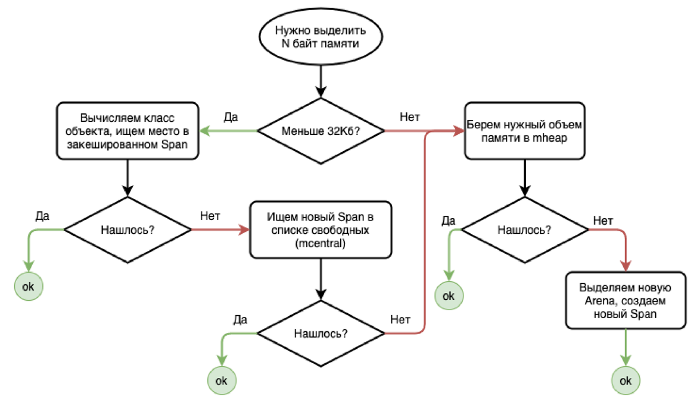

### Память в Go

#### Stack vs Heap

В Go, как и во многих других языках программирования, память делится на два основных типа: стек (stack) и кучу (heap).

- **Стек**:
    - Это область памяти, которая используется для хранения локальных переменных и управления вызовами функций.
    - Память в стеке выделяется и освобождается автоматически при входе и выходе из функций.
    - Стек работает по принципу LIFO (Last In, First Out), что делает операции с ним очень быстрыми.
    - Однако, размер стека ограничен, и его переполнение может привести к ошибкам.

- **Куча**:
    - Это область памяти, используемая для динамического выделения памяти.
    - Память в куче выделяется и освобождается вручную или с помощью сборщика мусора.
    - Куча позволяет выделять большие объемы памяти и управлять ими более гибко, но операции с ней медленнее, чем со стеком.

Иллюстрация:
```
+-------------------+       +-------------------+
|      Стек         |       |       Куча        |
|-------------------|       |-------------------|
| Локальные переменные |   | Динамически выделенная |
| Управление вызовами |   | память (объекты, данные)|
+-------------------+       +-------------------+
```

#### Выделение памяти: основные понятия

- **Arena**: Это большой блок памяти, обычно размером 64 МБ. Arenas используются для управления памятью в Go.
- **Page**: Это небольшой кусочек Arena, обычно размером 8 КБ.
- **Span**: Это несколько страниц (Pages), расположенных подряд. Span используется для управления блоками памяти разного размера.

Иллюстрация:
```
+-------------------+       +-------------------+       +-------------------+
|      Arena        |       |       Page         |       |       Span        |
|-------------------|       |-------------------|       |-------------------|
| 64 МБ             |       | 8 КБ              |       | Несколько Pages   |
+-------------------+       +-------------------+       +-------------------+
```

#### Выделение памяти: фрагментация

Фрагментация памяти происходит, когда свободные блоки памяти разбросаны по всей куче, что затрудняет выделение больших блоков памяти. В Go для управления фрагментацией используются Spans.

- **Фрагментация (спаны)**: Spans помогают уменьшить фрагментацию, объединяя несколько страниц в один блок, который может быть выделен или освобожден как единое целое.

#### Алгоритм выделения памяти

Алгоритм выделения памяти в Go включает несколько шагов:

1. **Поиск в кэше**: Сначала проверяется, есть ли подходящий Span в кэше.
2. **Поиск в списке свободных Spans**: Если в кэше ничего не найдено, поиск продолжается в списке свободных Spans.
3. **Выделение из кучи**: Если подходящий Span не найден, выделяется новый Span из кучи.
4. **Создание нового Span**: Если в куче нет свободного места, создается новый Arena и новый Span.

Иллюстрация алгоритма:

